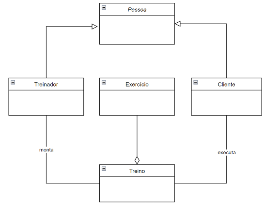

# Residência em Tecnologia da Informação e Comunicação
## INSTRUÇÃO PRÁTICA .NET-P004
### MÓDULO .NB – Formação .Net - Básico

**OBJETIVO DA ATIVIDADE TEMPO**
Colocar em prática os conceitos de Orientação a Objetos através do desenvolvimento, em grupo, de um protótipo de aplicação comercial. Além disso, estimular o desenvolvimento em equipe utilizando Git e Github.
4H

**DESCRIÇÃO**

Atividade em Grupo
Crie um repositório do grupo para esta atividade.
- No repositório do grupo, crie uma Branch para cada membro.
- O projeto final deve estar na Branch principal (main ou master) após merge com as branches individuais.
- A entrega deve ser feita, individualmente, no Moodle, informando o endereço do repositório e a BRANCH em que desenvolveu suas atividades.
- Utilize o fórum do Moodle para tirar suas dúvidas sobre as questões;

**Objetivo:**
Desenvolver um sistema de gerenciamento da academia Tech Fit.

**Desenvolvimento**

Implementar, obrigatoriamente, o gerenciamento das entidades abaixo e seus atributos, com as opções (telas) de inserir e remover para cada entidade. Além disso, a geração dos relatórios solicitados e a regra de negócio de acordo com o especificado abaixo.

### Classes
- **Treinador:**
  - Nome (string)
  - Data de Nascimento (DateTime)
  - CPF (tratar entrada com 11 dígitos) (string)
  - CREF (deve ser único entre os treinadores) (string)

- **Cliente:**
  - Nome (string)
  - Data de Nascimento (DateTime)
  - CPF (tratar entrada com 11 dígitos) (string)
  - Altura em cm (int)
  - Peso em kg (int)

- **Exercício:**
  - Grupo muscular (string)
  - Séries (int)
  - Repetições (int)
  - Tempo de intervalo em segundos (int)

- **Treino:**
  - Tipo (string)
  - Objetivo (string)
  - Lista de Exercícios (List<Exercício>)
  - Duração estimada em minutos (int)
  - Data de Início (DateTime)
  - Vencimento em dias (int)
  - Treinador Responsável (Treinador)
  - Clientes/Avaliação, que pode ser nulo ou entre 0 e 10 (List<(Cliente,int)>)

### UML

**Regras de negócio:**
- Um treino pode conter até 10 exercícios;
- Um treinador pode associar diversos treinos para diversos clientes;
- Cada cliente pode estar associado a, no máximo, 2 treinos;
- Ao associar o treino ao cliente, deverá ser registrada a data de Início e o vencimento (em dias) do treino;
- O cliente pode avaliar um treino.

**Relatórios:**
1. Treinadores com idade entre dois valores
2. Clientes com idade entre dois valores
3. Clientes com IMC (peso/altura*altura) maior que um valor informado, em ordem crescente
4. Clientes em ordem alfabética
5. Clientes do mais velho para mais novo
6. Treinadores e clientes aniversariantes do mês informado
7. Treinos em ordem crescente pela quantidade de dias até o vencimento.
8. Treinadores em ordem decrescente da média de notas dos seus treinos
9. Treinos cujo objetivo contenha determinada palavra.
10. Top 10 exercícios mais utilizados nos treinos.

**Dicas:**
- Utilize expressões lambda para cálculos específicos e consultas às listas.
- Implemente consultas LINQ para gerar relatórios personalizados.
- Utilize tratamento de exceções para garantir uma experiência de usuário mais robusta e amigável.

**REFERÊNCIAS**
- [Microsoft - Value Tuples](https://learn.microsoft.com/pt-br/dotnet/csharp/language-reference/builtintypes/value-tuples)
- [Microsoft - Lambda Expressions](https://learn.microsoft.com/pt-br/dotnet/csharp/language-reference/operators/lambda-expressions)
- [Microsoft - LINQ Introduction](https://learn.microsoft.com/pt-br/dotnet/csharp/programmingguide/concepts/linq/introduction-to-linq-queries)
- [Microsoft - Exception Handling](https://learn.microsoft.com/pt-br/dotnet/csharp/fundamentals/exceptions/)
